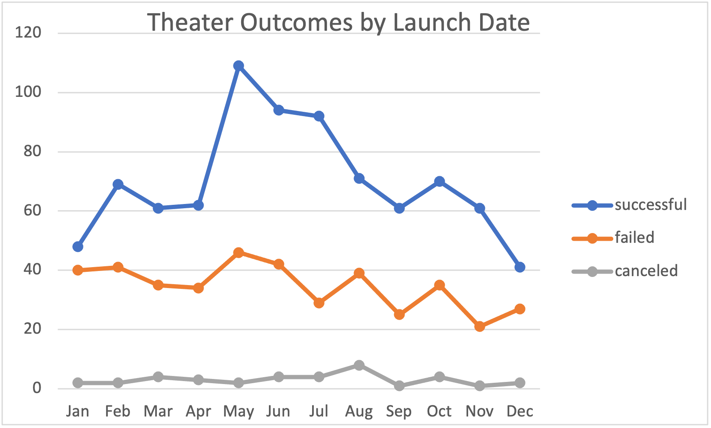
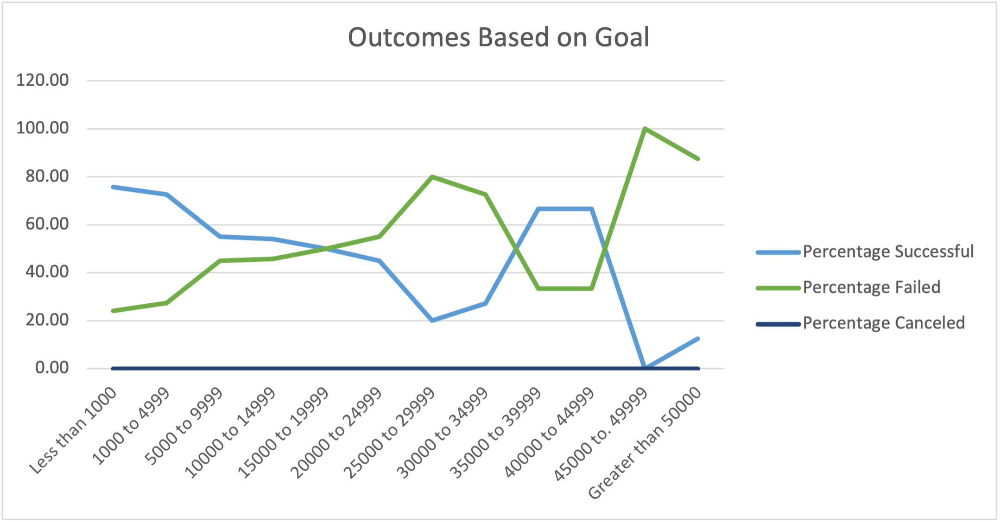

# Kickstarter-Analysis

# Kickstarting with Excel

## Overview of Project
This project analyzed data from various Kickstarter fundraising campaigns to help Louise, who is interested in launching her own fundraising project for a play she is working on. Data were organized in this excel spreadsheet: 

### Purpose
The purpose of this project was to provide Louise with insights about how to successfully launch a fundraising campaign based on data from past fundraising campaigns. To meet this purpose, the data was analyzed by examining the outcomes of campaigns based on launch date and goals. 

## Analysis and Challenges

### Analysis of Outcomes Based on Launch Date
The first analysis compared campaign outcomes (successful, failed, or canceled) to the month the campaign was launched. Because Louise is interested in launching a fundraiser for her play, data were limited to outcomes for theater campaigns. Data were first organized in a table. Then, for visual representation, a line graph was made by grouping month of launch to number of outcomes for successful, failed, or canceled campaigns.

### Analysis of Outcomes Based on Goals
The second analysis compared the campaign outcomes to the goal amount of money to be fundraised. Goal amounts were grouped into $5000 ranges, and the percentage of successful, failed, and canceled campaigns was calculated for each range. Similarly to the previous analysis, data was limited to that of plays because of Louise's interest in fundraising for a play. To provide a visual representation, a line graph was made with a line each for successful, failed, and canceled campaigns. 

### Challenges and Difficulties Encountered
One challenge encountered throughout the project was finding the source of errors in all aspects of the analysis: writing formulas in excel, preparing graphs, and creating charts all had the potential for mistakes. One thing that I found helpful in identifying where things went wrong is in 'retracing my steps' in a way, and going back step to step to see where mistakes may have occurred. 

## Results

- What are two conclusions you can draw about the Outcomes based on Launch Date?
The first conclusion that can be drawn about Outcomes based on Launch Date is that May is the most successful month of the year to launch a campaign; it by far had the most successful campaigns of any month of the year. Another conclusion that can be drawn is that December and January were the least successful and least popular months for launching campaigns; they had fewer campaigns overall, and of those, fewer were successful.  

- What can you conclude about the Outcomes based on Goals?
A conclusion that can be drawn from outcomes based on goals is that, overall, lower goals are more likely to be successful. 

- What are some limitations of this dataset?

- What are some other possible tables and/or graphs that we could create?
Another table that we could create 
